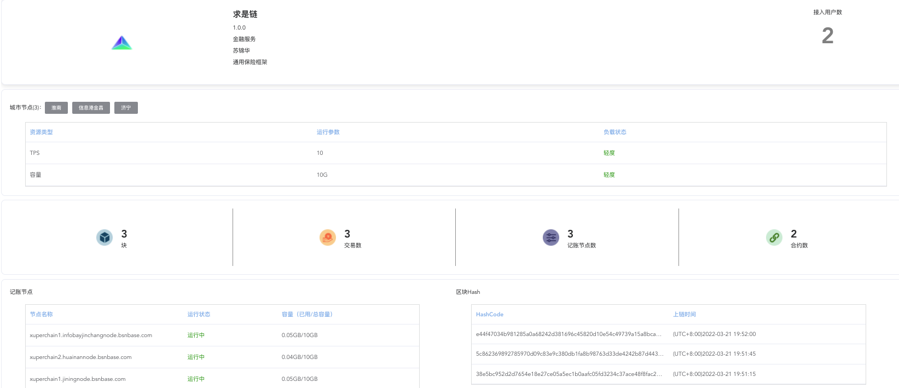
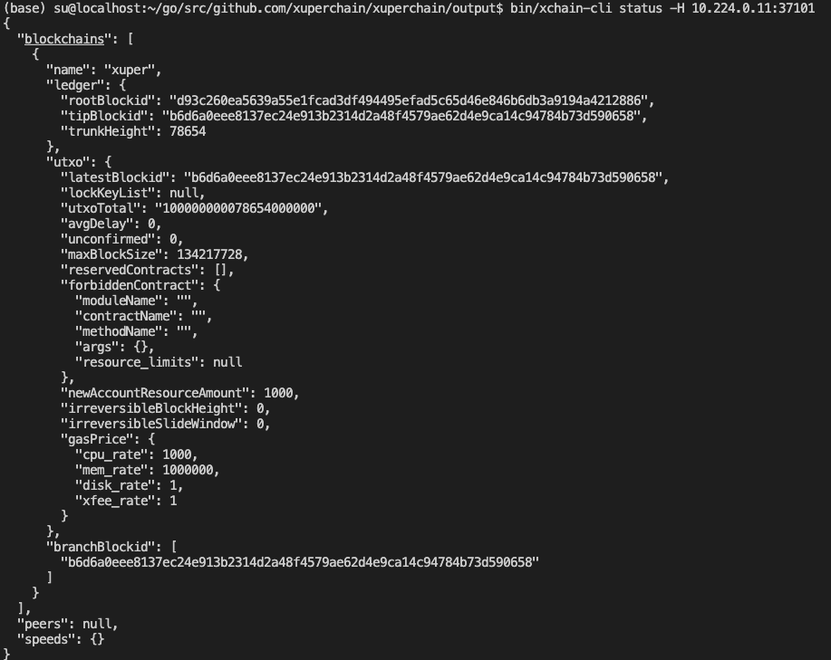

# BSN人大链技术方案

苏锦华

2022.03

---

## 内容

- BSN平台优势与资费优势
- BSN跨链优势与预言机可用情况
- BSN兼容的联盟链框架对比
- BSN下开放联盟链（有影响力的命名链）
- 人大链第一阶段：主流框架下联盟链+内网测试链+合约发布调用平台
- 人大链第二阶段：有人大特色的联盟链框架-求是链（命名权）
- 人大链第三阶段：BSN专有节点下的开放联盟链（扩大影响力）
- 人大链第四阶段：发布有特色的DDap-保险、养老、社科

---

## BSN平台优势与资费优势

https://ga2hks.yuque.com/docs/share/da4f8719-b119-4099-b329-53f2eb3aded2?# 《BSN以及联盟链相关重要概念》

https://ga2hks.yuque.com/docs/share/8cdc324b-841c-4896-ae68-8bdc5e1e38d3?# 《不同区块链与联盟链框架技术细节》

部署联盟链成本由一年至少10万减到2-3k即可（网络协议+专网)

节点增加或调整成本低（节点做到物理意义上的去中心化）

[节点运行情况](https://www.bsnbase.com/p/main/serviceNetworkDesc?type=RunningCondition) 开联盟链节点要求（3-60）

---

## BSN跨链优势与预言机可用情况

BSN定位是meta platform，并非有自己的框架而强制推广，支持更多的框架，做好基础设施，可以理解为云服务商。重点关注基本技术，比如跨链、数据接入等相关内容。

目前跨链支持Fabric和FCOS之间的跨链，XuperChain最近加入的，还不支持。预言机是layer级别的技术，各个链都能有自己的实现，测试链已经有了。

---

## BSN兼容的联盟链框架对比

[BSN所有适配框架](https://www.bsnbase.com/p/main/serviceNetworkDesc?type=AdapterFramework)

重点说明一下比较重要的：
- 国外第一的联盟链框架：Hyperledger Fabric是Linux基金会所主导的Hyperledger（超级账本）的项目之一。
- 国内开源第一的联盟链框架：FISCO BCOS是金链盟（微众银行）开源工作组打造的企业级金融联盟链底层平台，2017年开源，具有性能强劲。
- 各个企业级别开发的框架：百度超级链XuperChain、CITA溪塔科技、IRITA边界智能、Poly Enterprise分布科技、Chain33复杂美
  

---

## BSN下的开放联盟链（资费vs蚂蚁开放联盟链）

  开放联盟链是用于部署和运行各类区块链应用的一站式区块链服务运行环境。与传统联盟链服务相比，开放联盟链的应用共享记账节点资源，不同应用的智能合约可以相互可见及调用，共享使用区块链数据账本；链外业务系统可以通过节点网关简单、快速接入区块链网络进行交易处理。

  目前BSN开放联盟链已推出文昌链（基于IRITA）、泰安链（基于FISCO BCOS）、武汉链（基于Ethereum）、唐山链（基于DBChain）、广元链（基于Everscale）和中移链（基于EOS），BSN后续将持续集成更多的底层框架，欢迎大家使用并提出宝贵的意见和建议。

---

## 人大链第一阶段

- 主流框架下联盟链
  

---

## 人大链第一阶段 cont.

- 内网测试链10.224.0.11部署了单节点XuperChain

- 合约发布调用平台(web开发)

---

## 人大链第二阶段

有人大特色的联盟链框架-求是链（命名权）

简单：选定一个共识算法、选定一种合约语言，对标以太坊

难度：在现有主流框架下做增量，可信计算、社科属性、人大属性

---

## 后期

- 人大链第三阶段：BSN专有节点下的开放联盟链（扩大影响力）
- 人大链第四阶段：发布有特色的DDap-保险、养老、社科